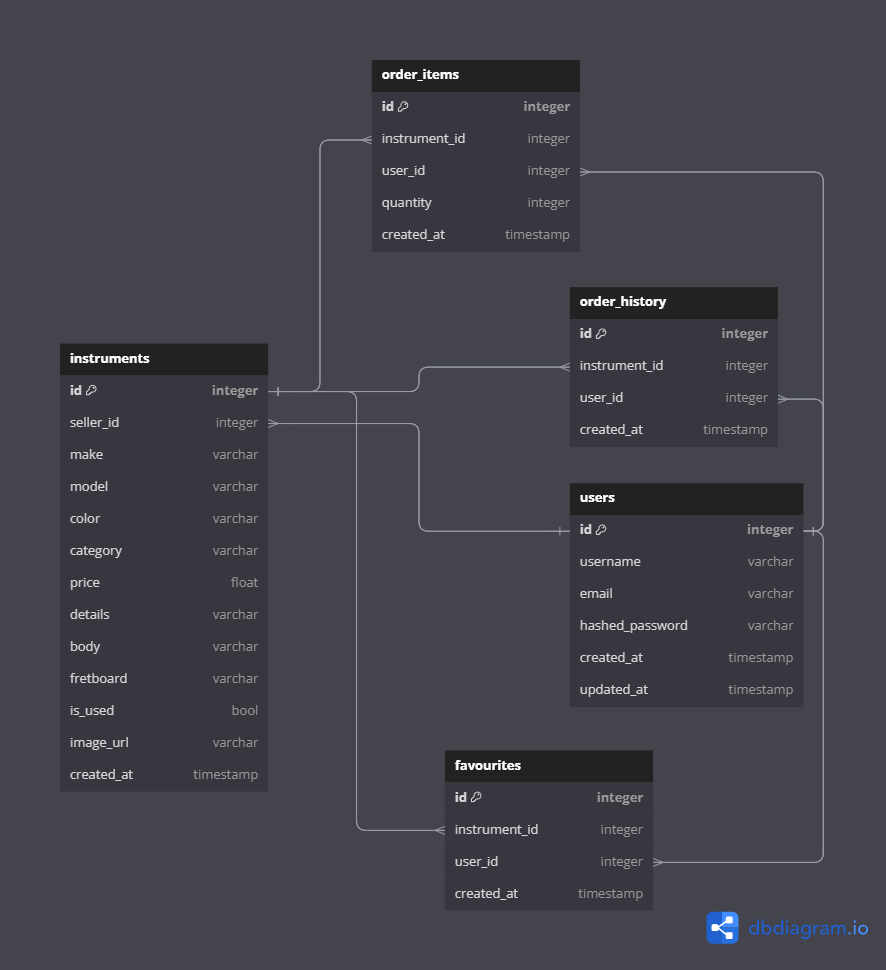

# RIFF HARBOR
  - Welcome to Riff Harbor – your premier destination for all things music! Our mission is to assist you in discovering the ideal instrument that perfectly complements your individual style and sonic expression. Let us guide you as you embark on your musical journey.

## Hosted On
[](https://riff-harbor.onrender.com)

## Contact Me
[](https://github.com/TylerHan1226)
[](https://www.linkedin.com/in/yucheng-han-2a3684254/)


## Data Schema


## Feature List
### 1. Instruments
* View all instruments
* Create new instruments.
* Update the instruments they have created.
* Delete the instruments they have created.

### 2. Order Items
* View all the order items created by the users.
* Add order items to cart.
* Update the the quantity of the order items they added.
* Remove their order items.
* Checkout (send data to order history)

### 3. Order History
* View all the orders histories created by the users.
* Create order history.
<!-- * Delete their order history. -->

### 4. Favorites
* View all the items added to the favorites.
* Add items to the favorites.
<!-- * Update the favorite list the user has created. -->
* Delete the item on favorite list the user has created.


## Bonus Feature
### 5. Amazon Web Services
* All media should be able to be stored in AWS.


### 6. Search / Sort & Filter
* Users should be able to view the results by sorting or filtering.
* Users should be able to view the results by searching car models or car locations.

## DEMO

### 1. User Login
Credentials / Demo user login button


### 2. Home Page
Instruments browsing & Dice (Randomize instruments)


### 3. Category & Filter
Instruments by Category


### 4. Create / Update Instrument
Post an instrument to sell ⏩ My Instrument ⏩ Update


DEMO DATA:
<br>make: Gibson 
<br>model: Gibson Slash Les Paul Standard
<br>Color: Victoria Gold Top
<br>Category: Electric Guitar
<br>Price: 3199
<br>Details: The Gibson Slash Les Paul Standard: crafted with solid mahogany body, AAA figured maple top, and a comfortable C-shaped neck for effortless solos. Burstbucker pickups deliver Slash's iconic midrange crunch, while vintage-style electronics and signature details complete the package. Available exclusively at Guitar Center, it's a must-have for serious rock guitarists.
<br>Body Material: Mahogany
<br>Fretboard Material: Maple
<br>image: (local image)

### 5. Instrument Detail Page & Favorites
Cart & Favorites ⏩ Add to Fav + Add to Cart (if the instrument is not already in the cart)


### 6. Cart
Update quantity and subtotal (remove item modal when quantity = 1) ⏩ remove item ⏩ Checkout


### 7. Order History
Order history with date, time and subtotal


### 8. Remove Instrument from Favorites


### 9. Remove Posted Instruments


# Technologies


# API Documentation
## USERS
### Get the Current User

Returns the information about the current user that is logged in.

* Require Authentication: false
* Request
  * Method: GET
  * URL: /api/auth
  * Body: none

* Successful Response when there is a logged in user
  * Status Code: 200
  * Headers:
    * Content-Type: application/json
  * Body:

    ```json
      {
        "user": {
          "id": 1,
          "email": "john1.smith@gmail.com",
          "username": "JohnSmith,"
        }
      }
    ```

* Successful Response when there is no logged in user
  * Status Code: 200
  * Headers:
    * Content-Type: application/json
  * Body:

    ```json
      {
        "user": null
      }
    ```

### Log In a User

Logs in a user with valid credentials and returns the current user's
information.

* Require Authentication: false
* Request
  * Method: POST
  * URL: /api/auth/login
  * Headers:
    * Content-Type: application/json
  * Body:

    ```json
      {
        "email": "john1.smith@gmail.com",
        "password": "password"
      }
    ```

* Successful Response
  * Status Code: 200
  * Headers:
    * Content-Type: application/json
  * Body:

    ```json
      {
        "user": {
          "id": 1,
          "email": "john1.smith@gmail.com",
          "username": "JohnSmith,"
        }
      }
    ```

* Error response: Inccorect Password
  * Status code: 401
  * Headers:
    * Content-Type: application/json
  * Body:

    ```json
      {
        "password": [
          "Password was incorrect."
        ]
      }
    ```

* Error response: Bad request
  * Status Code: 400
  * Headers:
    * Content-Type: application/json
  * Body:

    ```json
      {
        "email": [
          "This field is required" || "Email provided not found."
        ],
        "password": [
          "This field is required" || "Password was incorrect."
        ]
      }
    ```

### Log Out a User

Logs out the current user, ending their session.

* Require Authentication: True
* Request
  * Method: GET
  * URL: /api/auth/logout
  * Body: None

* Successful Response
  * Status Code: 200
  * Headers:
    * Content-Type: application/json
  * Body:

    ```json
      {
        "message": "User logged out"
      }
    ```


### Sign Up a User

Creates a new user, logs them in as the current user, and returns the current user's information.

* Require Authentication: false
* Request
  * Method: POST
  * URL: /api/auth/signup
  * Headers:
    * Content-Type: application/json
  * Body:

    ```json
      {
        "email": "john1.smith@gmail.com",
        "username": "JohnSmith",
        "password": "password"
      }
    ```

* Successful Response
  * Status Code: 200
  * Headers:
    * Content-Type: application/json
  * Body:

    ```json
      {
        "user": {
          "id": 1,
          "email": "john1.smith@gmail.com",
          "username": "JohnSmith,"
        }
      }
    ```

* Error response: User already exists with the specified email or username
  * Status Code: 400
  * Headers:
    * Content-Type: application/json
  * Body:

    ```json
    {
      "email": [
        "Email address is already in use."
      ],
      "username": [
        "Username is already in use."
      ]
    }
    ```

* Error response: Body validation errors
  * Status Code: 400
  * Headers:
    * Content-Type: application/json
  * Body:

    ```json
      {
        "email": [
          "This field is required" || "Email is invalid."
        ],
        "password": [
          "This field is required" || "Password must be at least 6 characters."
        ],
        "username": [
          "This field is required" || "Username must be at least 4 characters."
        ]
      }
    ```


## Instruments
### Get all instruments
* Require Authentication: False
* Request
  * Method: GET
  * URL: /api/instruments
  * Body: None

* Successful Response
  * Status Code: 200
  * Headers:
    * Content-Type: application/json
  * Body:

    ```json
      {
        "Products": [
          {
            "id": 1,
            "seller_id": 1,
            "model": "Fender American Vintage II 1951 Telecaster",
            "color": "Butterscotch Blonde",
            "category": "Electric Guitar",
            "price": 2449.99,
            "details": "The Fender American Vintage II 1951 Telecaster is a premium electric guitar, meticulously crafted to capture the essence of the original 1951 Telecaster. With its vintage style and iconic sound, it's a true tribute to Fender's historic legacy.",
            "body": "Maple",
            "fretboard": "Maple",
            "make": "Fender",
            "is_used": false,
            "image_url": "url.png",
            "createdAt": "2024-01-20 20:00:00"
          }
        ]
      }
    ```


### Get a instrument by id
* Require Authentication: True
* Request
  * Method: GET
  * URL: /api/instruments/:instrumentId
  * Body: None

* Successful Response
  * Status Code: 200
  * Headers:
    * Content-Type: application/json
  * Body:

    ```json
      {
        "id": 1,
        "seller_id": 1,
        "model": "Fender American Vintage II 1951 Telecaster",
        "color": "Butterscotch Blonde",
        "category": "Electric Guitar",
        "price": 2449.99,
        "details": "The Fender American Vintage II 1951 Telecaster is a premium electric guitar, meticulously crafted to capture the essence of the original 1951 Telecaster. With its vintage style and iconic sound, it's a true tribute to Fender's historic legacy.",
        "body": "Maple",
        "fretboard": "Maple",
        "make": "Fender",
        "is_used": false,
        "image_url" : "img.png"
        "createdAt": "2024-01-20 20:00:00"
      }
    ```

* Error response: Product not found
  * Status Code: 404
  * Headers:
    * Content-Type: application/json
  * Body:

    ```json
      {
        "message": "Product couldn't be found"
      }
    ```

### Create a instrument
* Require Authentication: True
* Request
  * Method: POST
  * URL: /api/instruments/new
  * Body:
    ```json
      {
        "make": "B.C. Rich",
        "model": "B.C. Rich Ironbird Extreme with Floyd Rose",
        "color": "Matte Black",
        "category": "Electric Guitar",
        "price": 1799.99,
        "details": "The BC Rich Ironbird, designed by Joey Rico in 1983, is a metal artist’s favorite. Its angular body shape features sharp, dagger-like points. With a 24-fret neck and licensed Floyd Rose tremolo, it’s built for shredding.",
        "body": "Basswood",
        "fretboard": "Rosewood",
        "is_used": true,
        "image_url" : "img.url"
      }
    ```

* Successful Response
  * Status Code: 200
  * Headers:
    * Content-Type: application/json
  * Body:

    ```json
      {
        "id": 2,
        "seller_id": 1,
        "make": "B.C. Rich",
        "model": "B.C. Rich Ironbird Extreme with Floyd Rose",
        "color": "Matte Black",
        "category": "Electric Guitar",
        "price": 1799.99,
        "details": "The BC Rich Ironbird, designed by Joey Rico in 1983, is a metal artist’s favorite. Its angular body shape features sharp, dagger-like points. With a 24-fret neck and licensed Floyd Rose tremolo, it’s built for shredding.",
        "body": "Basswood",
        "fretboard": "Rosewood",
        "is_used": true,
        "image_url" : "img.url;"
        "createdAt": "2024-01-20 20:00:00"
      }
    ```

* Error response: Body validation errors
  * Status Code: 400
  * Headers:
    * Content-Type: application/json
  * Body:

    ```json
      {
        "make": [
          "This field is required." || "Make must be under 100 characters"
        ],
        "model": [
          "This field is required." || "Model must be under 100 characters"
        ],
        "color": [
          "This field is required." || "Color must be under 100 characters"
        ],
        "category": [
          "This field is required." || "Category must be one of the following: Electric Guitar, Acoustic Guitar, Bass."
        ],
        "price": [
          "This field is required." || "Price must be greater than 0"
        ],
        "details": [
          "This field is required." || "Details must be greater than 25 characters"
        ],
        "body": [
          "This field is required." || "Body must be under 100 characters"
        ],
        "fretboard": [
          "This field is required." || "Fretboard must be under 100 characters"
        ],
        "is_used": [
          "This field is required."
        ],
        "image_url": [
          "This field is required."
        ]
      }
    ```

### Update a instrument
* Require Authentication: True
* Request
  * Method: PUT
  * URL: /api/instruments/:instrumentId/update
  * Body:
    ```json
      {
        "make": "B.C. Rich",
        "model": "B.C. Rich Ironbird Extreme 2025 Special Edition",
        "color": "Matte Black",
        "category": "Electric Guitar",
        "price": 1999.99,
        "details": "The BC Rich Ironbird, designed by Joey Rico in 1983, is a metal artist’s favorite. Its angular body shape features sharp, dagger-like points. With a 24-fret neck and licensed Floyd Rose tremolo, it’s built for shredding.",
        "body": "Basswood",
        "fretboard": "Rosewood",
        "is_used": true,
        "image_url" : "img.url;"
      }
    ```

* Successful Response
  * Status Code: 200
  * Headers:
    * Content-Type: application/json
  * Body:

    ```json
      {
        "id": 2,
        "seller_id": 1,
        "make": "B.C. Rich",
        "model": "B.C. Rich Ironbird Extreme 2025 Special Edition",
        "color": "Matte Black",
        "category": "Electric Guitar",
        "price": 1999.99,
        "details": "The BC Rich Ironbird, designed by Joey Rico in 1983, is a metal artist’s favorite. Its angular body shape features sharp, dagger-like points. With a 24-fret neck and licensed Floyd Rose tremolo, it’s built for shredding.",
        "body": "Basswood",
        "fretboard": "Rosewood",
        "is_used": true,
        "image_url" : "img.url;",
        "createdAt": "2024-01-20 20:00:00"
      }
    ```

* Error response: Instrument not found
  * Status Code: 404
  * Headers:
    * Content-Type: application/json
  * Body:

    ```json
      {
        "message": "Instrument couldn't be found"
      }
    ```

* Error response: Body validation errors
  * Status Code: 400
  * Headers:
    * Content-Type: application/json
  * Body:

    ```json
      {
        "make": [
          "This field is required." || "Make must be under 100 characters"
        ],
        "model": [
          "This field is required." || "Model must be under 100 characters"
        ],
        "color": [
          "This field is required." || "Color must be under 100 characters"
        ],
        "category": [
          "This field is required." || "Category must be one of the following: Electric Guitar, Acoustic Guitar, Bass"
        ],
        "price": [
          "This field is required." || "Price must be greater than 0"
        ],
        "details": [
          "This field is required." || "Details must be greater than 25 characters"
        ],
        "body": [
          "This field is required." || "Body must be under 100 characters"
        ],
        "fretboard": [
          "This field is required." || "Fretboard must be under 100 characters"
        ],
        "is_used": [
          "This field is required."
        ],
        "image_url": [
          "This field is required."
        ]
      }
    ```

### Delete a instrument by id

Delete an existing instrument by id.

* Require Authentication: True
* Require Authorization: True. (Must be the seller of the instrument)
* Request
  * Method: DELETE
  * URL: /api/instruments/:instrumentId/delete
  * Body: None

* Successful Response
  * Status Code: 200
  * Headers:
    * Content-Type: application/json
  * Body:

    ```json
      {
        "message": "Successfully deleted instrument"
      }
    ```

* Error response: Instrument not found
  * Status Code: 404
  * Headers:
    * Content-Type: application/json
  * Body:

    ```json
      {
        "message": "Instrument couldn't be found"
      }
    ```

## Orders

### Get all orders for the current user
* Require Authentication: True
* Request
  * Method: GET
  * URL: /api/orders
  * Body: None

* Successful Response
  * Status Code: 200
  * Headers:
    * Content-Type: application/json
  * Body:

    ```json
      {
        "OrderItems": [
        {
          "id": 1,
          "user_id": 1,
          "instrument_id": 2,
          "quantity": 1,
          "createdAt": "2024-01-20 20:00:00",
        },
        {
          "id": 2,
          "user_id": 1,
          "instrument_id": 3,
          "quantity": 1,
          "createdAt": "2024-01-20 20:00:00",
        }
        ]
      }
    ```

### Get all orders for the current user
* Require Authentication: True
* Request
  * Method: GET
  * URL: /api/orders/current
  * Body: None

* Successful Response
  * Status Code: 200
  * Headers:
    * Content-Type: application/json
  * Body:

    ```json
      {
        "CurrentOrders": [
        {
          "id": 1,
          "user_id": 1,
          "instrument_id": 2,
          "quantity": 1,
          "createdAt": "2024-01-20 20:00:00",
        },
        {
          "id": 2,
          "user_id": 1,
          "instrument_id": 3,
          "quantity": 1,
          "createdAt": "2024-01-20 20:00:00",
        }
        ]
      }
    ```


### Get the order by orderId
* Require Authentication: True
* Request
  * Method: GET
  * URL: /api/orders/:orderId
  * Body: None

* Successful Response
  * Status Code: 200
  * Headers:
    * Content-Type: application/json
  * Body:

    ```json
      {
        "id": 1,
        "user_id": 1,
        "instrument_id": 2,
        "quantity": 1,
        "createdAt": "2024-01-20 20:00:00",
      }
    ```


### Create an new order
* Require Authentication: True
* Request
  * Method: POST
  * URL: /api/orders/new
  * Body: None

* Successful Response
  * Status Code: 200
  * Headers:
    * Content-Type: application/json
  * Body:

    ```json
      {
        "instrument_id": 5
      }
    ```

* Error response: Can only add the same item once with the "Add to cart" button (update quantity in the cart page)
  * Status Code: 400
  * Headers:
    * Content-Type: application/json
  * Body:

    ```json
      {
        "message": "Cannot Add to cart"
      }
    ```


### Update the quantity of the order
* Require Authentication: True
* Request
  * Method: PUT
  * URL: /api/orders/:orderList/update
  * Body:
    ```json
      {
        "quantity": 2
      }
    ```

* Successful Response (when order quantity is greater than 0)
  * Status Code: 200
  * Headers:
    * Content-Type: application/json
  * Body:

    ```json
      {
        "id": 3,
        "instrument_id": 4,
        "quantity": 2
      }
    ```


* Error response: Order List not found
  * Status Code: 404
  * Headers:
    * Content-Type: application/json
  * Body:

    ```json
      {
        "message": "Order couldn't be found"
      }
    ```


### Delete the order
* Require Authentication: True
* Request
  * Method: DELETE
  * URL: /api/orders/:orderId/delete
  * Body: None

* Successful Response
  * Status Code: 200
  * Headers:
    * Content-Type: application/json
  * Body:

    ```json
      {
        "message": "Successfully Deleted"
      }
    ```

* Error response: Order List not found
  * Status Code: 404
  * Headers:
    * Content-Type: application/json
  * Body:

    ```json
      {
        "message": "Order couldn't be found"
      }
    ```


### Delete all the orders related to the current user
* Require Authentication: True
* Request
  * Method: DELETE
  * URL: /api/orders/current/clear
  * Body: None

* Successful Response
  * Status Code: 200
  * Headers:
    * Content-Type: application/json
  * Body:

    ```json
      {
        "message": "Successfully clear the cart"
      }
    ```

* Error response: Order List not found
  * Status Code: 400
  * Headers:
    * Content-Type: application/json
  * Body:

    ```json
      {
        "message": "There is nothing in your cart"
      }
    ```


## Order History

### Get all the order history
* Require Authentication: True
* Request
  * Method: GET
  * URL: /api/history
  * Body: None

* Successful Response
  * Status Code: 200
  * Headers:
    * Content-Type: application/json
  * Body:

    ```json
      {
        "OrderHistory": [
        {
          "id": 1,
          "user_id": 1,
          "instrument_id": 2,
          "quantity": 1,
          "createdAt": "2024-01-20 20:00:00",
        },
        {
          "id": 2,
          "user_id": 1,
          "instrument_id": 3,
          "quantity": 1,
          "createdAt": "2024-01-20 20:00:00",
        }
        ]
      }
    ```

### Get all order history of the current user
* Require Authentication: True
* Request
  * Method: GET
  * URL: /api/history/current
  * Body: None

* Successful Response
  * Status Code: 200
  * Headers:
    * Content-Type: application/json
  * Body:

    ```json
      {
        "UserOrderHistory": [
        {
          "id": 1,
          "user_id": 1,
          "instrument_id": 2,
          "quantity": 1,
          "createdAt": "2024-01-20 20:00:00",
        },
        {
          "id": 2,
          "user_id": 1,
          "instrument_id": 3,
          "quantity": 1,
          "createdAt": "2024-01-20 20:00:00",
        }
        ],
        "HistoryInst": [
          {
            "id": 2,
            "seller_id": 1,
            "model": "Fender American Vintage II 1951 Telecaster",
            "color": "Butterscotch Blonde",
            "category": "Electric Guitar",
            "price": 2449.99,
            "details": "The Fender American Vintage II 1951 Telecaster is a premium electric guitar, meticulously crafted to capture the essence of the original 1951 Telecaster. With its vintage style and iconic sound, it's a true tribute to Fender's historic legacy.",
            "body": "Maple",
            "fretboard": "Maple",
            "make": "Fender",
            "is_used": false,
            "image_url": "url.png",
            "createdAt": "2024-01-20 20:00:00"
          },
          {
            "id": 3,
            "seller_id": 1,
            "make": "B.C. Rich",
            "model": "B.C. Rich Ironbird Extreme with Floyd Rose",
            "color": "Matte Black",
            "category": "Electric Guitar",
            "price": 1799.99,
            "details": "The BC Rich Ironbird, designed by Joey Rico in 1983, is a metal artist’s favorite. Its angular body shape features sharp, dagger-like points. With a 24-fret neck and licensed Floyd Rose tremolo, it’s built for shredding.",
            "body": "Basswood",
            "fretboard": "Rosewood",
            "is_used": true,
            "image_url" : "https://res.cloudinary.com/do8l6gpqp/image/upload/v1711557057/Riff-Harbor/test-eg-1_esfxhj.jpg",
            "createdAt": "2024-01-20 20:00:00"
          }
        ]
      }
    ```


### Add to history
* Require Authentication: True
* Request
  * Method: POST
  * URL: /api/history/new
  * Body: 

    ```json
      {
        "instrument_id": 5,
        "quantity": 2
      }
    ```

* Successful Response
  * Status Code: 200
  * Headers:
    * Content-Type: application/json
  * Body:

    ```json
      {
        "message": "History is stored successfully"
      }
    ```

* Error response: Need to have a valid instrument id and quantity
  * Status Code: 400
  * Headers:
    * Content-Type: application/json
  * Body:

    ```json
      {
        "message": "Cannot Add to History"
      }
    ```


### Delete the history
* Require Authentication: True
* Request
  * Method: DELETE
  * URL: /api/history/:historyId/delete
  * Body: None

* Successful Response
  * Status Code: 200
  * Headers:
    * Content-Type: application/json
  * Body:

    ```json
      {
        "message": "Successfully Deleted"
      }
    ```

* Error response: Order List not found
  * Status Code: 404
  * Headers:
    * Content-Type: application/json
  * Body:

    ```json
      {
        "message": "Order history is not found"
      }
    ```


## Favorites

### Get all the favorite items under the user
* Require Authentication: True
* Request
  * Method: GET
  * URL: /api/favorites/current
  * Body: None

* Successful Response
  * Status Code: 200
  * Headers:
    * Content-Type: application/json
  * Body:

    ```json
      {
        "MyFavorites": [
        {
          "id": 1,
          "user_id": 1,
          "instrument_id": 2,
          "createdAt": "2024-01-20 20:00:00",
        },
        {
          "id": 2,
          "user_id": 1,
          "instrument_id": 3,
          "createdAt": "2024-01-20 20:00:00",
        }
        ],
        "FavInst": [
          {
            "id": 2,
            "seller_id": 1,
            "model": "Fender American Vintage II 1951 Telecaster",
            "color": "Butterscotch Blonde",
            "category": "Electric Guitar",
            "price": 2449.99,
            "details": "The Fender American Vintage II 1951 Telecaster is a premium electric guitar, meticulously crafted to capture the essence of the original 1951 Telecaster. With its vintage style and iconic sound, it's a true tribute to Fender's historic legacy.",
            "body": "Maple",
            "fretboard": "Maple",
            "make": "Fender",
            "is_used": false,
            "image_url": "url.png",
            "createdAt": "2024-01-20 20:00:00"
          },
          {
            "id": 3,
            "seller_id": 1,
            "make": "B.C. Rich",
            "model": "B.C. Rich Ironbird Extreme with Floyd Rose",
            "color": "Matte Black",
            "category": "Electric Guitar",
            "price": 1799.99,
            "details": "The BC Rich Ironbird, designed by Joey Rico in 1983, is a metal artist’s favorite. Its angular body shape features sharp, dagger-like points. With a 24-fret neck and licensed Floyd Rose tremolo, it’s built for shredding.",
            "body": "Basswood",
            "fretboard": "Rosewood",
            "is_used": true,
            "image_url" : "https://res.cloudinary.com/do8l6gpqp/image/upload/v1711557057/Riff-Harbor/test-eg-1_esfxhj.jpg",
            "createdAt": "2024-01-20 20:00:00"
          }
        ]
      }
    ```


### Add to favorites
* Require Authentication: True
* Request
  * Method: POST
  * URL: /api/favorites/new
  * Body: 
    ```json
      {
        "instrument_id": 5
      }
    ```

* Successful Response
  * Status Code: 200
  * Headers:
    * Content-Type: application/json
  * Body:
    ```json
      {
        "message": "Add to favorites"
      }
    ```


* Error response: Need to have a valid instrument id
  * Status Code: 400
  * Headers:
    * Content-Type: application/json
  * Body:

    ```json
      {
        "message": "Cannot Add to favorites"
      }
    ```


### Delete the favorites
* Require Authentication: True
* Request
  * Method: DELETE
  * URL: /api/favorites/:favoriteId/delete
  * Body: None

* Successful Response
  * Status Code: 200
  * Headers:
    * Content-Type: application/json
  * Body:

    ```json
      {
        "message": "Successfully Deleted"
      }
    ```

* Error response: Order List not found
  * Status Code: 404
  * Headers:
    * Content-Type: application/json
  * Body:

    ```json
      {
        "message": "Favorite item is not found"
      }
    ```# my-stocks
